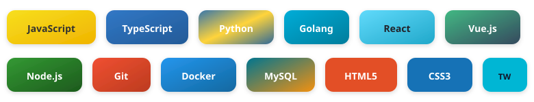

|   |   |
| - | - |

 

***

## 📊 GitHub Stats

<!-- 纯 SVG 统计表卡片，外部文件引用，动画完整 -->

  

 

***

## 🛠 Tech Stack

<!-- 技术栈徽章，SVG 文件引用 -->

  

 

***

## 🔗 Connect with me

<!-- 社交链接：每个图标使用独立 SVG 文件引用，保证 GitHub 正确渲染 -->

| [ **GitHub** ](https://github.com/wzxgA) | [ **Email** ](mailto:wzxgA@example.com) | [ **Blog** ](#) | [ **Twitter** ](#) | **WeChat** |
| ---------------------------------------- | --------------------------------------- | --------------- | ------------------ | ---------- |

 

***

  

